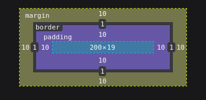
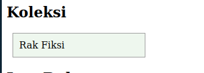
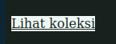
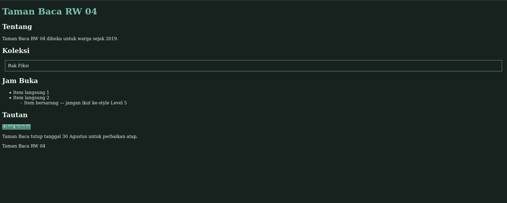

# Cek Visual — Pertemuan 2

`npm run levels` memeriksa mekanisme CSS-nya (properti ada, selector
mencocokkan elemen yang benar, dst) lewat parsing teks dan mesin selector
jsdom — bukan tampilan sungguhan (jsdom tidak menjalankan layout). Level di
bawah ini butuh mata untuk konfirmasi akhir. Maksimal 10 detik per kriteria
per mahasiswa.

## Level 3 — Box model

- [x] Buka di browser — kotak "Rak Fiksi" punya jarak dari tepinya sendiri
      (padding) DAN garis tepi (border) DAN jarak dari elemen sekitarnya
      (margin) — ketiganya terlihat berbeda, bukan cuma satu yang terasa?
      

## Level 4 — border-box (dua tangkapan layar)

Ini level yang secara eksplisit minta perbandingan visual:

- [x] Screenshot tampilan SEBELUM `box-sizing: border-box` ditambahkan

- [x] Screenshot tampilan SESUDAHnya

- [x] Bandingkan: elemen yang punya padding/border besar — lebar totalnya
      berubah tidak antara dua screenshot itu? (Seharusnya TIDAK berubah
      dengan border-box, karena padding & border ikut dihitung ke DALAM
      lebar yang ditentukan, bukan menambah di luar)

## Level 6 — :hover dan :focus-visible

- [x] Arahkan mouse ke tombol "Lihat koleksi" — ada perubahan visual yang
      jelas (bukan cuma kursor berubah)?
- [x] Klik di area lain dulu, lalu tekan Tab sampai fokus sampai ke tombol
      itu — ada indikator fokus yang jelas terlihat?

## Level 10 — Tema gelap

- [x] DevTools → Rendering → Emulate CSS media feature
      `prefers-color-scheme` → pilih `dark`
- [x] Apakah SELURUH halaman berubah skema warnanya (latar gelap, teks
      terang), bukan cuma sebagian?
- [x] Apakah teksnya masih terbaca jelas (bukan teks gelap di atas latar
      gelap, atau sebaliknya)?

---

Kalau ada yang lolos `npm run levels` tapi gagal salah satu di atas, catat
di kolom "catatan" saat melapor ke dosen.
